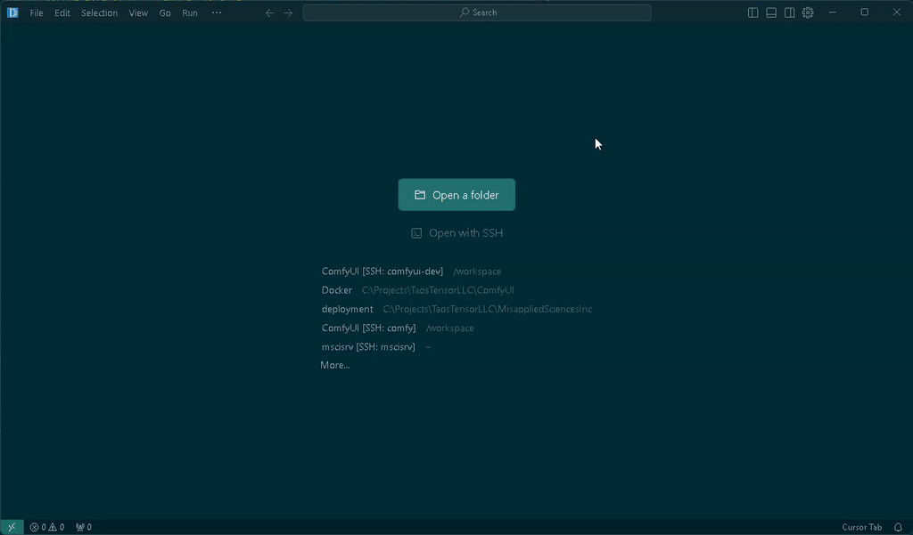

# Secure ComfyUI Development Docker Container



* [Github](https://github.com/nomcycle/comfyui-dev)
* [Docker](https://hub.docker.com/repository/docker/nomcycle/comfyui-dev)

A secure, remote, and persistent development environment for ComfyUI that works with cloud GPU services. This container combines [Tailscale's](https://tailscale.com) secure VPN service with [VSCode's remote development](https://code.visualstudio.com/docs/remote/remote-overview) capabilities, making it perfect for developing on services like [RunPod](https://www.runpod.io/). Your development environment persists between sessions, so you only pay for GPU time when actively developing.

## Quick Start

1. Set up Tailscale and get an auth key ([Instructions](#tailscale-setup))
2. Configure VSCode with SSH keys ([Instructions](#vscode-setup))
3. Create a RunPod deployment with the required environment variables ([Instructions](#runpod-setup))
4. Connect to your development environment ([Instructions](#connecting-to-your-environment))
5. Start ComfyUI ([Instructions](#running-comfyui-from-vscode))
6. Debugging ([Instructions](#debugging--breakpoints))

## Environment Variables

**Required:**
- `COMFY_DEV_TAILSCALE_AUTH` - Your Tailscale authentication key
- `COMFY_DEV_SSH_PUBKEY` - Your SSH public key for VSCode remote access

**Optional:**
- `COMFY_DEV_PYTHON_VERSION` - Python version for the environment (default: 3.10)
- `COMFY_DEV_START_COMFY` - Set to `true` to start ComfyUI automatically
- `COMFY_DEV_GIT_FORK` - URL to your ComfyUI fork (if using one)

## Detailed Setup Instructions

### Tailscale Setup

1. Create or log in to your [Tailscale account](https://login.tailscale.com)
2. Install Tailscale on your development machine
3. Navigate to: `Settings > Keys` (or visit https://login.tailscale.com/admin/settings/keys)
4. Generate a new auth key:
   - Click **"Generate auth key..."**
   - Add a description (e.g., "ComfyUI Dev Container")
   - Enable **"Reusable"** (allows key reuse when recreating containers)
   - Enable **"Ephemeral"** (auto-removes offline devices)
   - Copy and save the generated key securely

### VSCode Setup

1. Install Required Extensions:
   - **Remote - SSH**
   - **Python**

2. Configure VSCode Settings:
   - Open Command Palette (`Ctrl+Shift+P`)
   - Search for `Open Settings (JSON)`
   - Add these settings:
```json
{
    "remote.SSH.remotePlatform": {
        "comfyui-dev": "linux"
    },
    "remote.SSH.serverInstallPath": {
        "comfy": "/workspace/"
    }
}
```

3. Set up SSH:

**Linux/macOS:**
```bash
# Create SSH directory
mkdir -p ~/.ssh/

# Generate SSH key pair
ssh-keygen -t ed25519 -f ~/.ssh/comfyui-dev -C "comfy"

# Add config entry
cat >> ~/.ssh/config << EOF
Host comfyui-dev
    HostName comfyui-dev
    User comfy
    IdentityFile ~/.ssh/comfyui-dev
EOF
```

**Windows (PowerShell):**
```powershell
# Create SSH directory
New-Item -ItemType Directory -Force -Path "$env:USERPROFILE\.ssh"

# Generate SSH key pair
ssh-keygen -t ed25519 -f "$env:USERPROFILE\.ssh\comfyui-dev" -C "comfy"

# Add config entry (creates new or appends to existing config)
$sshConfig = @"

Host comfyui-dev
    HostName comfyui-dev
    User comfy
    IdentityFile $env:USERPROFILE\.ssh\comfyui-dev
"@
Add-Content -Path "$env:USERPROFILE\.ssh\config" -Value $sshConfig
```

### RunPod Setup

1. Create Network Volume:
   - Choose a region close to you
   - Recommended size: 256GB
   - Mount point: `/workspace`

2. Create RunPod Secrets:
   - `COMFY_DEV_TAILSCALE_AUTH`: Your Tailscale auth key
   - `COMFY_DEV_SSH_PUBKEY`: Contents of `~/.ssh/comfyui-dev.pub`

3. Deploy Container:
   - Select your Network Volume
   - Choose GPU type
   - Template: Search for `nomcycle/comfyui`
   - Set environment variables
   - Deploy

### Connecting to Your Environment

1. Open VSCode
2. Press `Ctrl+Shift+P`
3. Type `Connect to Host...`
4. Select `comfyui-dev`
5. Wait for VSCode Server installation
6. Use `File > Open Folder` to open `/workspace/ComfyUI`

### Running ComfyUI from VSCode
1. Open a new terminal window while connected to remote host in VSCode.
2. Execute `python main.py --listen 0.0.0.0`

### Debugging & Breakpoints
1. When you install an extension in VSCode, you can install it in the current workspace, or remotely, install the python extension for the remote host.
2. Create launch.json in /workspace/ComfyUI/.vscode
3. Add the following content:
```
{
    "version": "0.2.0",
    "configurations": [
        {
            "name": "ComfyUI",
            "type": "debugpy",
            "request": "launch",
            "program": "main.py",
            "console": "integratedTerminal",
            "args": "--listen 0.0.0.0",
            "python": "/workspace/miniconda/envs/comfy/bin/python",
            "justMyCode": true
        }
    ]
}
```
3. Press (F5) to run ComfyUI 

## Troubleshooting

### Tailscale Device Conflicts
If recreating containers quickly, manually remove old devices from Tailscale dashboard. Ensure current device is named `comfyui-dev`.

### SSH Connection Issues
- Verify environment variable `COMFY_DEV_SSH_PUBKEY` is set correctly
- Check SSH config file format
- Ensure private key permissions are correct: `chmod 600 ~/.ssh/comfyui-dev`

### Container Startup
Initial setup takes 2-5 minutes for:
- Container deployment
- Tailscale authentication
- Python environment setup
- ComfyUI repository cloning
- Dependencies installation

Need more help? [Open an issue](https://github.com/nomcycle/comfyui-dev/issues)